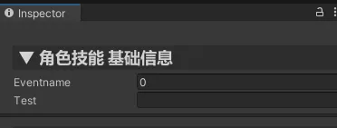

## 开始前
本篇内容均基于演示项目`ActionEditorExample`为例。
项目地址：https://nobug.cn/project/420082917445957

## 创建Asset

以演示项目中的`Scripts/ActionEditorExample/Runtime/SkillAsset.cs`为例。

我们要创建一个技能资产。那么只需要继承`Asset`就可以了。需要注意的就是class需要为`public`。

```c#
[Name("角色技能")]
public class SkillAsset : Asset
{

}
```

假如我们会将项目技能细分，比如主动技能，被动技能或者英雄技能怪物技能。在这种情况我们可能想有一个公共的基类。那么我们是可以使用继承的。如下

```c#
[Name("英雄技能")]
public class HeroSkillAsset : SkillAsset
{

}
```

如果我们不希望父类是可以被创建的资产。那么只需要将父类设置为`abstract`即可。如下：

```c#
public abstract class SkillAsset : Asset //抽象类不能被创建
{

}

[Name("英雄技能")]
public class HeroSkillAsset : SkillAsset
{

}
```

## 资产字段

如果想给资源添加一些可设置字段，只需要添加`public`的成员变量即可，如下：

```c#
[Name("角色技能")]
public class SkillAsset : Asset
{
    public string Test;
    public int EventName;
}
```

效果




字段详细使用说明，请查看`成员变量`使用章节