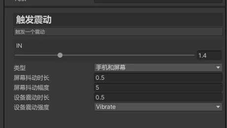

# 成员变量使用
> 本篇为重点篇章，着重介绍`Asset`,`Track`,`Clip`中成员变量的使用说明

### 定义普通成员

按照正常Unity的Editor GUI操作一样，无需设置特殊内容，如下：

```c#
public int test1;
public string test2;
public float test3;
```

如上既可以定义相关成员变量。当前序列化到inspector支持类型如下

- int
- float
- bool
- string
- Color
- Object
- Enum
- AnimationCurve
- Vector2
- Vector3
- Vector2Int
- Vector3Int
- Rect
- RectInt
- Bounds


## 成员自定义名称

可以给成员变量指定显示的名称，设置特性`MenuName`既可，这样方便使用人员理解，比如中文名称，如下:

```c#
[MenuName("事件名称")]
public int eventName;
```


## 关联选项 OptionParam

假如我们字段是一个int值或是string值，但是我们希望这个字段的值只能在我们可控范围内。比如我们只希望，只能填写 0 1 2 3。

那么我们这时候可以使用特性`OptionParam`

具体可参考`TriggerEvent.cs`

```c#
[MenuName("事件名称")] [OptionParam(typeof(EventNames))]
public int eventName;
```

如上代码既将字段和`EventNames`类进行了关联，只能从EventNames中选取相关数值，如下：

```c#
public partial class EventNames
{
    [OptionSort(0)] public const int None = 0;
    [MenuName("测试事件")] public const int Test = 1;
    [MenuName("触发击中")] public const int Hit = 2;
    [MenuName("必杀检测")] public const int Kill = 3;
}
```

使用效果如下，int字段也变成了一个选择菜单：


### 成员变量排序 Order

当我们成员变量过多，且有继承关系时，我们希望成员变量显示是可控的时候。

我们可以给成员变量添加`Order`特性。这时我们就可以自定义成员变量的显示顺序了。

```c#
[Order(1)] [MenuName("事件名称")] [OptionParam(typeof(EventNames))]
public int eventName;
```


### 显示条件

当我们想让某些字段需要其他字段符合要求才显示，比如`TriggerShake.cs`中，当我们选择`屏幕震度`时才显示皮你过目抖动幅度字段。

这时候我们可以使用`OptionRelateParam`特性，以下脚本展示了关联条件。

```c#
[MenuName("类型")] [OptionParam(typeof(EventShakeType))]
public int shakeType;

[MenuName("屏幕抖动时长")] [OptionRelateParam("shakeType", EventShakeType.Screen, EventShakeType.ScreenAndPhone)]
public float duration = 0.5f;

[MenuName("屏幕抖动幅度")] [OptionRelateParam("shakeType", EventShakeType.Screen, EventShakeType.ScreenAndPhone)]
public int range = 5;

[MenuName("设备震动时长")] [OptionRelateParam("shakeType", EventShakeType.Phone, EventShakeType.ScreenAndPhone)]
public float vibrationDuration = 0.5f;

[MenuName("设备震动强度")]
[OptionParam(typeof(EventShakeForceType))]
[OptionRelateParam("shakeType", EventShakeType.Phone, EventShakeType.ScreenAndPhone)]
public int vibrationForce = EventShakeForceType.Default;
```

效果如下：




在不同参数下，显示不同的填写内容

> 值得注意的时，该参数只控制显示隐藏，定义的所有成员变量还是会序列化到Asset资产中。


### 【重要】对象资源路径

很多情况下，我们需要播放粒子或者音频视频等，如果我们将字段设置为Object。

那么我们打包ab时，这个时间轴资产会依赖这个Object，将对象打包进入ab。

但实际业务中，我们只希望时间轴Asset中只有资源路径。但是又希望对象又是可选取的

```c#
[SelectObjectPath(typeof(AudioClip))]
public string resPath = "";
```

如上，使用`SelectObjectPath`特性，既可以将string关联一个资源路径，这时候就可以选取相关对象，而只存下资源路径了。

具体可以参考示例中的`PlayAudio.cs`和`PlayParticl.cs`

## 范围选择

设置一个范围值，如下，设置范围为0-10

```c#
[Range(0f, 10f)] public float volume = 1;
```