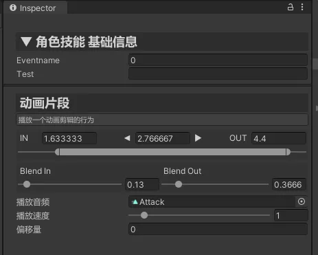
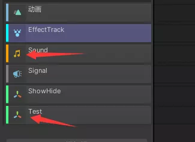

## 开始前
本篇内容均基于演示项目`ActionEditorExample`为例。

[TOC]

## 创建Track

我们以演示代码`EffectTrack.cs`为例，如下：

```c#
[Name("特效轨道")]
[Description("播放特效的轨道，粒子特效等")]
[ShowIcon(typeof(ParticleSystem))]
[Color(0f, 1f, 1f)]
public class EffectTrack : Track
{
    [MenuName("轨道层")] [OptionParam(typeof(TrackLayer))]
    public int Layer;
}
```

只需要继承`Track`即可定义一个轨道，如果是父类轨道不希望是可以使用的，和`Asset`一样，只需要设置`abstract`既可。

## 特性说明

介绍Track的特性

### Name and Description

轨道名称和介绍，会在Inspector中显示，如下图




### ShowIcon 

轨道的显示图标，支持`Type`和`path路径`。

输入type时，既为使用指定类型脚本的图标，本类型可以让显示图标为unity内置的一些脚本图标。

输入为资源路径时，则为自定义图片，如：`Assets/ResRaw/test.png`

图标设置后，效果如下：




### Color

轨道显示在图标前的颜色，用于快速分辨轨道类型，效果如上图