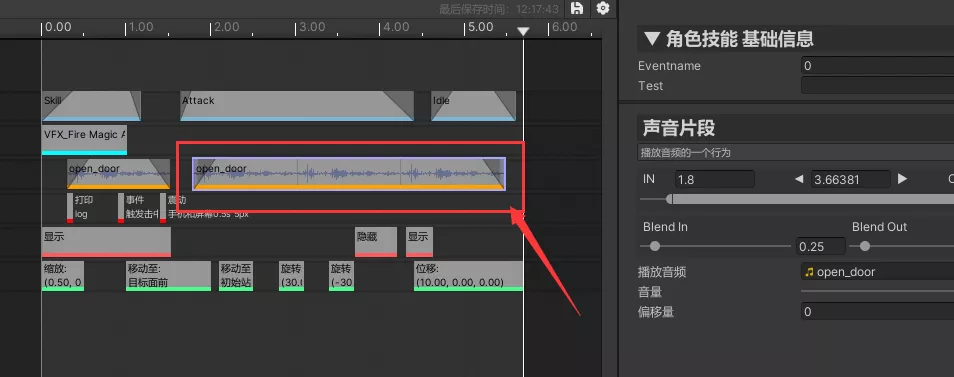
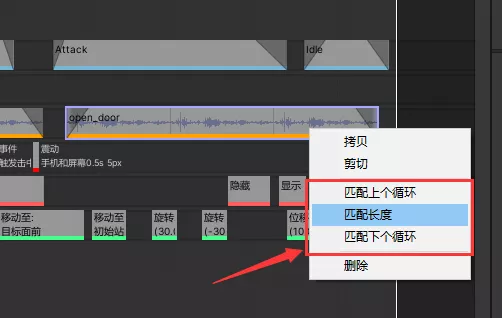
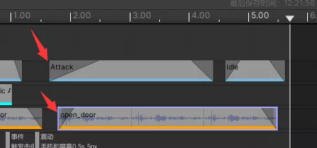

## 开始前
本篇内容均基于演示项目`ActionEditorExample`为例。
项目地址：https://nobug.cn/project/420082917445957

## 创建Clip

如下代码既创建了一个基本的剪辑切片，只需要继承`ActionClip`即可

```c#
[Name("普通粒子片段")]
[Description("播放一个粒子特效")]
[Color(0.0f, 1f, 1f)]
[Attachable(typeof(EffectTrack))]
public class TestClip : ActionClip
{

}
```

## 关联轨道

特性`Attachable`既指定剪辑只能添加到哪些轨道，允许指定多个，如`[Attachable(typeof(EffectTrack), typeof(SignalTrack))]`

## 长度可变剪辑

只需要重写父类中的`Length`字段既可成为一个可以拖动改变长度的剪辑，否则默认为没有长度的剪辑，如下：

```c#
[Name("普通粒子片段")]
[Description("播放一个粒子特效")]
[Color(0.0f, 1f, 1f)]
[Attachable(typeof(EffectTrack))]
public class TestClip : ActionClip
{
	[SerializeField] [HideInInspector] private float length = 1f;
    //设置长度
    public override float Length
    {
        get => length;
        set => length = value;
    }
}
```

## 可匹配长度剪辑(内循环轨道)

在一些特殊情况，比如特效，视频，音频我们可能希望它可以循环播放，且我们能较好的控制和预览循环次数。那么这种情况下就可以使用内循环轨道。

以`PlayAudio.cs`为例。只需要实现`ISubClipContainable`接口即可，这种情况下菜单中既可出现匹配长度按钮，且可以看到分段信息。如下图




如上图中的音频播放，可以看到我们循环播放上3次，可以通过右键菜单增减循环次数，如下图




### 渐入渐出剪辑

以演示代码`PlayAudio.cs`和`PlayAnimation.cs`为例，只需要重写BlendIn和BlendOut既可自定义剪辑的渐入渐出数值，如下：

```c#
public override float BlendIn
{
    get => blendIn;
    set => blendIn = value;
}

public override float BlendOut
{
    get => blendOut;
    set => blendOut = value;
}
```

效果如下图：




通过该数值，我们就能在播放或预览中读取并实现自己想要的渐入渐出效果了

## 可用状态

通过`isValid`来设置是否可用

```c#
public override bool isValid => audioClip != null;
```

如上代码，当没设置音效资源时，提示clip不可用，显示error错误。参考`PlayAudio.cs`


## 文字描述

如下，显示事件的描述信息。

```c#
public override string info => "事件\n" + AttributesUtility.GetMenuName(eventName, typeof(EventNames));
```

其中`AttributesUtility.GetMenuName`是获取可选项关联的自定义Name。

### 自定义字段

字段详细使用说明，请查看`成员变量`使用章节