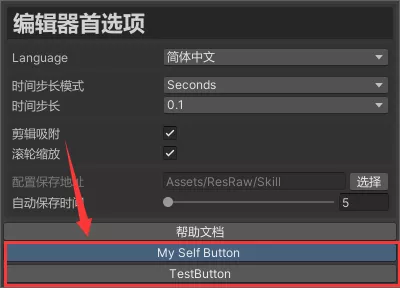
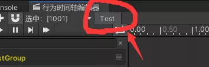

> 本篇主要介绍，如何在编辑器中添加自己的GUI界面

## 必看说明

不建议直接修改项目的GUI相关源码，因为ActionEditor是会迭代更新的，如果修改了代码，则可能存在兼容性问题。

所有建议各位coder，尽量通过提供的重写接口来重写界面。这样也能直接更新更新版本的ActionEditor，而不导致自己的代码丢失问题

## 自定义首选项界面

继承`PreferencesGUI`类，即可重写相关界面。首选项允许重写OnGUI和DrawHelpButton。如果希望添加更多内容，可用重写OnGUI

如果只是想把帮助文档跳转跳转，则可以只重写DrawHelpButton

```c#
public class SelfPreferencesGUI : PreferencesGUI
{
    public override void OnGUI()
    {
        base.OnGUI();
        if (GUILayout.Button("TestButton"))
        {
            Debug.Log("Hello");
        }
    }

    protected override void DrawHelpButton()
    {
        base.DrawHelpButton();

        if (GUILayout.Button("My Self Button"))
        {
            Application.OpenURL("https://nobug.cn/book/414447506088261");
        }
    }
}
```

效果如下



## 重写工具条

个体HeaderBar添加一个按钮

```c#
public class SelfHeaderGUI : HeaderGUI
{
    protected override void DrawToolbarLeft()
    {
        base.DrawToolbarLeft();
        if (GUILayout.Button(new GUIContent("Test"), EditorStyles.toolbarButton,
                GUILayout.Width(46)))
        {
            Debug.Log("这是一个自定义按钮");
        }
    }
}
```

效果如下




## 重写WelcomeGUI界面

方法同上，继承`WelcomeGUI`既可以重写菜单和Logo